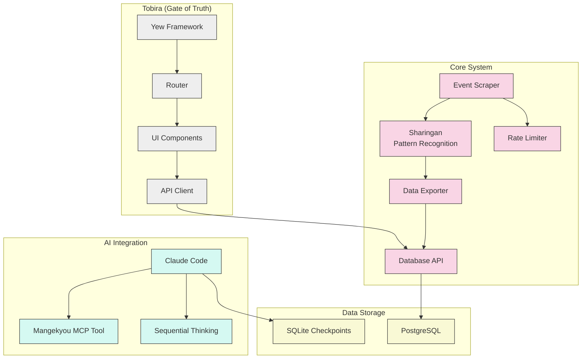

# iHoje Event Scraper

A Rust-based event data collection system with anime-inspired module naming.

## Documentation

- [Claude Context System Documentation](/docs/claude/README.md) - Multi-tiered context system for Claude Code
- [Project Documentation](/docs/project/README.md) - Contributing, testing, and general guides
- [Domain Documentation](/docs/domain/README.md) - Technical implementation details

## Core Modules

| Module | Description | Documentation |
|--------|-------------|---------------|
| **Sharingan** | Event pattern recognition system (Naruto) | [/docs/domain/sharingan_implementation.md](/docs/domain/sharingan_implementation.md) |
| **Tobira** | WebAssembly frontend gate (Fullmetal Alchemist) | [/tobira/README.md](/tobira/README.md) |
| **Mangekyou** | Implementation planning system (Naruto) | [/scripts/mangekyou-mcp/README.md](/scripts/mangekyou-mcp/README.md) |

## Architecture

## Claude Commands

| Command | Token Usage | Purpose |
|---------|-------------|---------|
| `just claude-micro` | ~200 tokens | Quick questions, simple commands |
| `just claude-minimal` | ~500 tokens | Focused tasks with minimal context |
| `just claude` | ~1000 tokens | Standard development tasks |
| `just claude-domain DOMAIN` | ~1200 tokens | Domain-specific tasks (sharingan, frontend, mangekyou) |
| `just dump-context` | ~3000+ tokens | Complex tasks requiring full context |

For more details on the Claude context system, see the [Claude Context System Documentation](/docs/claude/README.md).