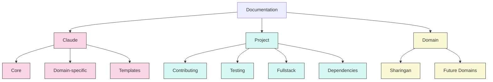

# iHoje Documentation

Welcome to the iHoje documentation. This directory contains comprehensive documentation for the iHoje project, organized into logical sections.

## Documentation Structure

### `/docs/claude/`

Documentation related to the Claude Code context system and AI interaction:

- **Core**: Core context files for configuration, caching, and system behavior
  - [bootstrap.md](/docs/claude/core/bootstrap.md) - Configuration settings
  - [cache.md](/docs/claude/core/cache.md) - Task progress tracking
  - [checkpoints.md](/docs/claude/core/checkpoints.md) - Task tracking system
  - [critical.md](/docs/claude/core/critical.md) - High-priority issues
  - [guidelines.md](/docs/claude/core/guidelines.md) - Development guidelines
  - [optimization.md](/docs/claude/core/optimization.md) - Token optimization

- **Domain**: Domain-specific documentation for specialized areas of the codebase
  - [sharingan.md](/docs/claude/domain/sharingan.md) - Event scraping module
  - [tobira.md](/docs/claude/domain/tobira.md) - Frontend module
  - [mangekyou.md](/docs/claude/domain/mangekyou.md) - Implementation planning

- **Templates**: Template files for creating new context documents
  - [cache_template.md](/docs/claude/templates/cache_template.md) - Cache template
  - [context_template.md](/docs/claude/templates/context_template.md) - Domain context template

See the [Claude Context System Documentation](/docs/claude/README.md) for complete details.

### `/docs/project/`

General project documentation:

- [Contributing Guide](/docs/project/contributing.md) - How to contribute to iHoje
- [Testing Guide](/docs/project/testing.md) - Testing approach and best practices
- [Fullstack Development](/docs/project/fullstack.md) - Frontend and backend architecture
- [Dependency Update Guide](/docs/project/dependency_updates.md) - Guidance on updating dependencies

### `/docs/domain/`

Technical documentation for core domains in the codebase:

- [Sharingan Implementation](/docs/domain/sharingan_implementation.md) - Event pattern recognition system

## Migration Status

This documentation structure is a transition from the previous flat organization. The files have been copied to the new structure, and the claudefile.just has been updated to reference the new locations. Once the transition is complete, the old CLAUDE_* files at the root can be removed.

## Updating Documentation

When updating documentation:

1. Follow the established directory structure
2. Use Mermaid for all diagrams 
3. Keep cross-references up to date
4. Maintain the same style and formatting

## Key Documentation Files

| Documentation | Purpose | Location |
|---------------|---------|----------|
| Project Overview | General information | [/README.md](/README.md) |
| Claude Context System | AI integration | [/docs/claude/README.md](/docs/claude/README.md) |
| Contributing Guide | How to contribute | [/docs/project/contributing.md](/docs/project/contributing.md) |
| Testing Guide | Testing approach | [/docs/project/testing.md](/docs/project/testing.md) |