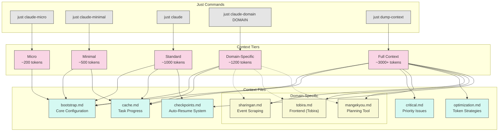

# Claude Context System Documentation

This document explains the token optimization system for Claude Code in the iHoje repository.

## Overview

The Claude Context System uses a multi-tiered approach for managing context in Claude Code sessions. It provides different levels of context depending on task complexity and token usage requirements.



## Context Files Explained

### Core Context Files

1. **bootstrap.md**
   - **Purpose**: Core configuration and project settings
   - **Content**: Configuration flags, project description, language settings
   - **Used by**: All context tiers
   - **Token usage**: ~100 tokens
   - **When to modify**: When changing core project configurations

2. **cache.md**
   - **Purpose**: Tracks current task progress and history
   - **Content**: Current task name, description, step checklist, notes
   - **Used by**: Minimal, Standard, Domain, and Full contexts
   - **Token usage**: ~150-300 tokens (varies with task complexity)
   - **When to modify**: Updated automatically by task commands

3. **checkpoints.md**
   - **Purpose**: Provides checkpoint system for task tracking
   - **Content**: Step tracking, error recovery, resume instructions
   - **Used by**: Standard and Full contexts
   - **Token usage**: ~400 tokens
   - **When to modify**: When enhancing the checkpoint system

4. **critical.md**
   - **Purpose**: High-priority issues requiring immediate attention
   - **Content**: Critical issue description, diagnosis, solutions
   - **Used by**: When a critical issue exists (loaded first)
   - **Token usage**: ~300-600 tokens
   - **When to modify**: When critical issues arise or are resolved

5. **optimization.md**
   - **Purpose**: Token optimization strategies and best practices
   - **Content**: Context tiers, token usage guidelines, optimization tips
   - **Used by**: Standard and Full contexts
   - **Token usage**: ~400 tokens
   - **When to modify**: When improving token optimization strategies

### Domain-Specific Context Files

1. **domain/sharingan.md**
   - **Purpose**: Context for event scraping and pattern recognition
   - **Content**: Sharingan system architecture, patterns, code examples
   - **Used by**: Domain-specific (sharingan) and Full contexts
   - **Token usage**: ~350 tokens
   - **When to modify**: When changing Sharingan implementation

2. **domain/tobira.md** (renamed from CLAUDE_FRONTEND.md)
   - **Purpose**: Context for Yew/WASM frontend components
   - **Content**: Frontend architecture, component patterns, code examples
   - **Used by**: Domain-specific (frontend) and Full contexts
   - **Token usage**: ~350 tokens
   - **When to modify**: When changing frontend implementation

3. **domain/mangekyou.md**
   - **Purpose**: Context for implementation planning MCP tool
   - **Content**: Mangekyou architecture, usage patterns, code examples
   - **Used by**: Domain-specific (mangekyou) and Full contexts
   - **Token usage**: ~350 tokens
   - **When to modify**: When changing Mangekyou implementation

### Template Files

1. **templates/cache_template.md**
   - **Purpose**: Template for resetting the cache file
   - **Content**: Minimal cache structure without task data
   - **Used by**: Reset command
   - **Token usage**: ~20 tokens
   - **When to modify**: When changing cache structure

2. **templates/context_template.md**
   - **Purpose**: Template for creating new domain-specific contexts
   - **Content**: Section structure for domain contexts
   - **Used by**: When creating new domain files
   - **Token usage**: ~100 tokens
   - **When to modify**: When changing domain file structure

## Context Tiers and Commands

| Tier | Command | Token Usage | Files Loaded | Best For |
|------|---------|-------------|--------------|----------|
| **Micro** | `just claude-micro` | ~200 tokens | bootstrap.md | Quick questions, simple tasks |
| **Minimal** | `just claude-minimal` | ~500 tokens | bootstrap.md, cache.md | Focused tasks with minimal context |
| **Standard** | `just claude` | ~1000 tokens | bootstrap.md, cache.md, guidelines.md | General development tasks |
| **Domain** | `just claude-domain DOMAIN` | ~1200 tokens | bootstrap.md, cache.md, domain file | Domain-specific tasks |
| **Full** | `just dump-context` | ~3000+ tokens | All context files | Complex tasks requiring full context |

### 1. Micro Context (~200 tokens)
```bash
just claude-micro [ARGS]
```
- **Loads**: Only bootstrap.md
- **Best for**: Quick questions, simple tasks, checking status
- **Examples**: "What's in this directory?", "Show me file X"

### 2. Minimal Context (~500 tokens)
```bash
just claude-minimal [ARGS]
```
- **Loads**: bootstrap.md and cache.md
- **Best for**: Focused tasks within clear scope
- **Examples**: "Create this function", "Fix this specific bug"

### 3. Standard Context (~1000 tokens)
```bash
just claude [ARGS]
```
- **Loads**: bootstrap.md, cache.md, and guidelines.md
- **Best for**: General development tasks
- **Examples**: "Implement feature X", "Refactor module Y"

### 4. Domain-Specific Context (~1200 tokens)
```bash
just claude-domain DOMAIN [ARGS]
# Where DOMAIN is one of: sharingan, frontend, mangekyou
```
- **Loads**: Bootstrap, cache, and domain-specific context
- **Best for**: Specialized tasks in a specific domain
- **Examples**: "Update the Sharingan pattern matcher", "Add a new Tobira component"

### 5. Full Context (~3000+ tokens)
```bash
just dump-context
```
- **Loads**: All context files
- **Best for**: Complex tasks requiring complete context
- **Examples**: "Redesign core architecture", "Implement cross-cutting feature"

## Implementation Details

### Loading Mechanism

The context loading system uses specially designed Bash scripts:

1. **claude.justfile**: Contains the main context loading commands
2. **claude-micro.sh**: Loads minimal bootstrap for micro context
3. **claude-minimal.sh**: Loads bootstrap and cache for minimal context
4. **claude-domain.sh**: Loads domain-specific context with bootstrap

The bash scripts perform some key operations:
- Validate that domain exists
- Create temporary context file with relevant content
- Track current task from cache.md
- Add ongoing task steps to context
- Launch Claude with concatenated context

### Token Usage Tracking

The `claude-token-tracker.sh` script:
- Estimates token usage for each context file
- Analyzes context combinations
- Provides optimization suggestions

```bash
# Analyze token usage
just token-usage

# Check specific file
just token-usage docs/claude/domain/sharingan.md
```

### Checkpoint System Integration

The context system integrates with the checkpoint system:

1. `just add-task "task_name" "description"`: Creates new task
2. `just mark-step-complete "task" "step" "info"`: Marks progress
3. `just mark-step-failed "task" "step" "error"`: Records failures
4. `just task-cache`: Shows current task status

When loading context, the system automatically includes:
- Current task information
- Next pending steps
- Last few completed steps

## Domain-Specific Context Guidelines

When creating or updating domain-specific context files:

1. **Keep them focused** (~350 tokens maximum)
2. **Include these sections**:
   - Core Concepts (brief explanation)
   - Components & Architecture (with simple diagram)
   - Common Patterns (recurring design patterns)
   - Code Examples (minimal examples)
   - Implementation Notes (constraints, performance)
   - Related Files (key file paths)
3. **Format for clarity** (headings, lists, code blocks)
4. **Minimize token usage** (remove unnecessary details)

## Usage Best Practices

1. **Choose the Right Context Tier**
   - Start with the lowest tier that might work
   - Escalate to higher tiers only when necessary
   - Use domain-specific contexts for specialized work

2. **Use the Checkpoint System**
   ```bash
   # Start a task
   just add-task "feature-x" "Implement feature X"
   
   # Track progress
   just mark-step-complete "feature-x" "Create structure" "Added basic structure"
   just mark-step-failed "feature-x" "Connect database" "Connection timeout"
   
   # Show current task status
   just task-cache
   ```

3. **Monitor Token Usage**
   ```bash
   # Analyze token usage
   just token-usage
   
   # Check specific file
   just token-usage docs/claude/domain/sharingan.md
   ```

4. **Break Complex Tasks into Steps**
   - Use the checkpoint system to split work
   - Focus each Claude session on a specific subtask
   - Use different context tiers for different steps

5. **Keep Context Files Updated**
   - Update domain files when patterns change
   - Keep documentation concise and focused
   - Remove outdated information

## Integration with MCP Tools

The context system works with MCP tools for enhanced capabilities:

1. **Sharingan Domain + Puppeteer MCP**: For event scraping
2. **Frontend Domain + Browser MCP**: For frontend development
3. **Mangekyou Domain + Sequential-Thinking MCP**: For implementation planning

Start MCP tools:
```bash
just mcp-start
```

Check status:
```bash
just mcp-status
```

## Critical Mode

When critical issues arise:

1. Create docs/claude/core/critical.md with issue details
2. Use `just claude-critical` to prioritize the issue
3. Once resolved, remove or archive the critical file