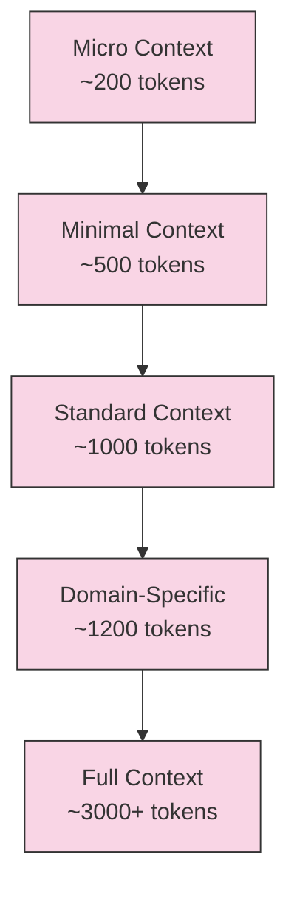

# Claude Code Token Optimization Strategies

## Overview

This document outlines strategies for optimizing token usage when working with Claude Code in the iHoje repository. Proper token management allows more efficient use of the API while maintaining functionality.

## Context Tiers System



### Token Usage by Context Type

| Context Tier | Command | Token Count | Components | Best Used For |
|--------------|---------|-------------|------------|---------------|
| Micro | `just claude-micro` | ~200 | bootstrap.md | Quick questions, status checks |
| Minimal | `just claude-minimal` | ~500 | bootstrap.md, cache.md | Focused single-file tasks |
| Standard | `just claude` | ~1000 | bootstrap.md, cache.md, guidelines.md | General development work |
| Domain | `just claude-domain DOMAIN` | ~1200 | bootstrap.md, cache.md, domain-specific | Component-specific work |
| Full | `just dump-context` | ~3000+ | All context files | Complex architectural tasks |

## Optimization Strategies

### 1. Document Organization

- **Concise Documentation**: Keep documentation focused and minimal
- **Hierarchical Structure**: Use clear headings and nested lists
- **Modularity**: Break large files into domain-specific modules
- **Cross-References**: Use references instead of duplicating content

### 2. Task Management

- **Task Checkpoints**: Maintain context across sessions without full history
- **Focused Steps**: Break complex tasks into discrete steps
- **Progress Tracking**: Use `just mark-step-complete` to track progress
- **Context-Aware Resumption**: Resume from the appropriate step

### 3. Claude Interaction

- **Tier Selection**: Use the lowest context tier that can handle the task
- **Directive Commands**: Provide clear, specific instructions
- **Context Switching**: Use domain-specific contexts for specialized work
- **Session Management**: Close sessions when finished

### 4. Document Structure

- **Structured Documentation**: Use consistent formatting
- **Visual Representations**: Use mermaid diagrams instead of long text explanations
- **Code Examples**: Keep examples minimal but complete
- **Tokenization Awareness**: Structure content for efficient tokenization

## Token Usage by File

| File | Token Count | Description |
|------|-------------|-------------|
| bootstrap.md | ~100 | Core configuration |
| cache.md | ~150-300 | Task progress tracking |
| guidelines.md | ~500 | Development guidelines |
| checkpoints.md | ~400 | Checkpoint system |
| critical.md | ~300-600 | Critical issues (when present) |
| optimization.md | ~400 | Token optimization strategies |
| domain/sharingan.md | ~350 | Sharingan system context |
| domain/tobira.md | ~350 | Frontend context |
| domain/mangekyou.md | ~350 | Implementation planning context |

## Implementation Details

### Token Estimation

Token estimation uses the following approximation:
- 1 token ≈ 4 characters for English text
- 1 token ≈ 1 word for English text
- Code tokens vary by language and syntax

The `claude-token-tracker.sh` script provides more accurate measurement.

### Loading Optimization

The context loading system optimizes token usage by:
- Loading only necessary files for each context tier
- Trimming unnecessary whitespace
- Removing duplicate information
- Prioritizing critical information

## Best Practices

1. **Use the Right Context Tier**: Match the tier to your task complexity
2. **Focus Your Tasks**: Narrow the scope of each Claude session
3. **Monitor Token Usage**: Use `just token-usage` to track consumption
4. **Structure Your Content**: Organize for efficient tokenization
5. **Document with Purpose**: Include only necessary information

## Domain-Specific Workflows

### Sharingan (Pattern Recognition)
```bash
just claude-domain sharingan
```
Optimized for event scraping tasks with relevant context.

### Tobira (Frontend)
```bash
just claude-domain frontend
```
Optimized for WebAssembly frontend development.

### Mangekyou (Implementation Planning)
```bash
just claude-domain mangekyou
```
Optimized for structured implementation planning.