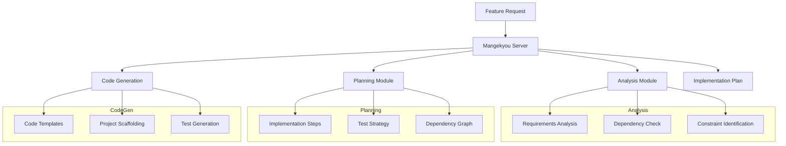

# Mangekyou Context

## Core Concepts
- Mangekyou: Implementation planning system (based on Naruto's Mangekyou Sharingan)
- MCP Tool: Model Context Protocol integration
- Implementation Planning: Structured approach to feature development
- Code Generation: Template-based code production

## Components & Architecture



## Server Components

### Mangekyou Server
- FastAPI-based HTTP server
- MCP protocol implementation
- Context extraction and processing
- Template management

### Analysis Module
- Requirements extraction
- Dependency identification
- Constraint validation
- Feasibility assessment

### Planning Module
- Step sequencing
- Dependency resolution
- Resource estimation
- Risk assessment

### Generation Module
- Template selection
- Code scaffolding
- Test case generation
- Documentation creation

## Implementation Notes

### Server Configuration
- Runs on port 17891
- Memory limited to 700MB
- Response timeout: 30 seconds
- Input size limit: 100KB

### Error Handling
- Graceful degradation with partial plans
- Detailed error reporting
- Automatic retry for transient failures
- Resource exhaustion protection

### Security Considerations
- No external network access
- Input validation and sanitization
- Resource usage limits
- No filesystem access outside project directory

## Usage Guide

### Starting the Server
```bash
just mcp-start
```

### Checking Server Status
```bash
just mcp-status
```

### Creating Implementation Plans
```bash
just plan-implementation "feature_name" "feature description"
```

### Common Operations
- `just mcp-logs`: View server logs
- `just mcp-restart`: Restart the server
- `just mcp-stop`: Stop the server

## Troubleshooting
- Always use `just stop-mangekyou` to ensure clean shutdown
- Check logs at `/tmp/mangekyou-mcp.log`
- Verify port availability with `lsof -i:17891`
- Resource limits can be adjusted in `justfiles/mcp.justfile`

## Related Files
- `/scripts/mangekyou-mcp/mangekyou_mcp/server.py`: Main server implementation
- `/scripts/mangekyou-mcp/run_mangekyou.sh`: Server startup script
- `/justfiles/mcp.justfile`: MCP tool commands
- `/scripts/mangekyou.py`: Standalone implementation