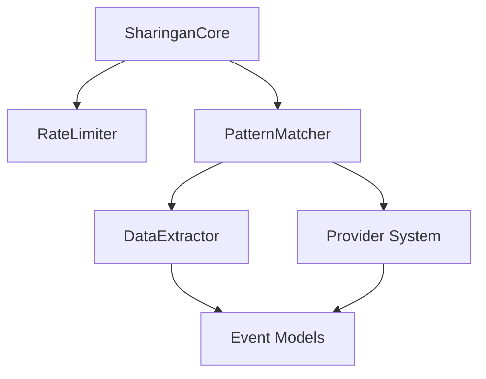

# Sharingan Context

## Core Concepts
- Sharingan: Visual pattern recognition system for extracting structured data from HTML
- DOM Traversal: Intelligent traversal of HTML DOM to identify data patterns
- Event Extraction: Automated extraction of event information from various sources
- Provider Architecture: Pluggable system for different event data sources

### Key Terminology
- Pattern Recognition: Identifying repeating structures in HTML
- DOM Path: XPath or CSS selector path to elements
- Provider: Source-specific implementation for data extraction
- Extraction Rules: Configuration for pattern matching

## Components & Architecture 
- SharinganScraper: Main coordinator for scraping operations
- PatternMatcher: Identifies recurring patterns in DOM
- DataExtractor: Extracts structured data from matched patterns
- RateLimiter: Controls request frequency to prevent blocking



## Common Patterns
- Provider Implementation: Each provider implements the `Provider` trait
- Async Scraping: All operations are async for better performance
- Error Handling: Comprehensive error handling with context
- Rate Limiting: All requests pass through rate limiter

## Code Examples
```rust
// Provider trait implementation
impl Provider for ExampleProvider {
    async fn fetch_events(&self, config: &Config) -> Result<Vec<Event>> {
        // Implementation with pattern recognition
        let html = self.client.get(&url).send().await?.text().await?;
        let events = sharingan::extract_events(&html, &self.patterns)?;
        Ok(events)
    }
}
```

## Implementation Notes
- Respect robots.txt and site terms of service
- Implement backoff strategies for failed requests
- Cache results to minimize duplicate scraping
- Use structured logging for debugging

## Related Files
- `/src/sharingan.rs` - Core implementation
- `/src/providers/mod.rs` - Provider trait definition
- `/src/providers/*.rs` - Individual provider implementations
- `/src/rate_limiter.rs` - Rate limiting implementation