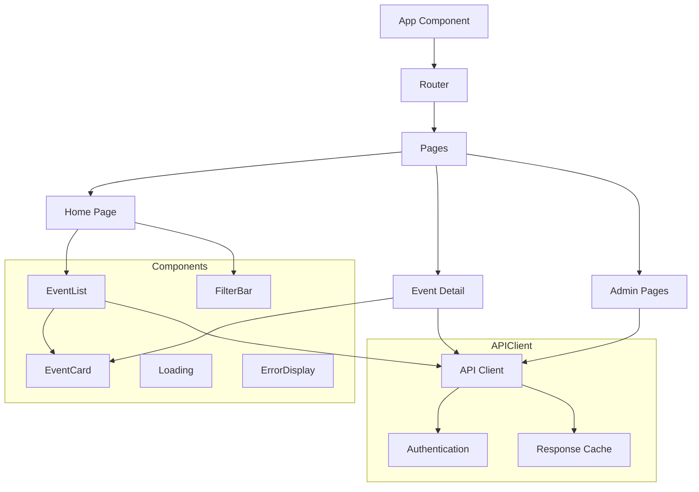

# Tobira (Frontend) Context

## Core Concepts
- Tobira: WebAssembly-based frontend "Gate of Truth" (Fullmetal Alchemist reference)
- Yew: Rust-based reactive frontend framework
- WebAssembly: Binary instruction format for web browsers
- Event Display: Component system for showing event data

## Components & Architecture

## Key Components

### Pages
- `home_page.rs`: Main event listing view
- `event_detail_page.rs`: Individual event details
- `admin/*.rs`: Admin pages for event management
- `login_page.rs`: Authentication interface
- `error_page.rs`: Error handling view

### UI Components
- `event_list.rs`: Displays grid of event cards
- `event_card.rs`: Individual event display
- `filter_bar.rs`: Interface for filtering events
- `ui/loading.rs`: Loading indicator
- `ui/error_display.rs`: Error message component

### API Integration
- `api/client.rs`: Core API client with request handling
- `api/auth.rs`: Authentication handling
- `api/error.rs`: API error handling

### Utilities
- `utils/config.rs`: Frontend configuration
- `utils/geolocation.rs`: Location services
- `utils/storage.rs`: Local storage handling
- `utils/hooks.rs`: Custom Yew hooks

## State Management
- Component-local state with `use_state` hook
- Context providers for shared state
- API-based data fetching with loading states

## Implementation Notes

### Performance Optimization
- WebAssembly binary size optimization
- Lazy loading for event details
- API response caching
- Efficient component rendering with keys

### Development Workflow
- `just run-tobira`: Run development server
- `just build-tobira`: Build production bundle
- `just tobira-test`: Run frontend tests

## Internationalization
- `i18n/translations.rs`: Text strings
- `i18n/language.rs`: Language selection
- `i18n/components.rs`: Internationalized components

## Related Files
- `/tobira/src/main.rs`: Application entry point
- `/tobira/src/app.rs`: Root component
- `/tobira/src/router.rs`: Route configuration
- `/tobira/Cargo.toml`: Frontend dependencies
- `/tobira/index.html`: HTML template
- `/tobira/Trunk.toml`: WASM bundler configuration