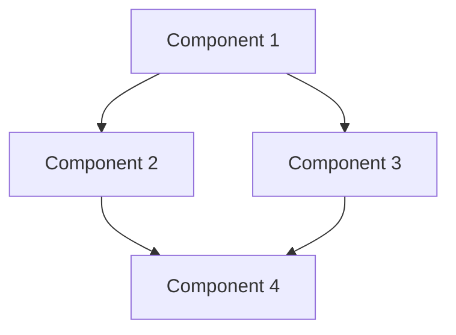

# DOMAIN_NAME Context

## Core Concepts
- Concept 1: Brief explanation
- Concept 2: Brief explanation
- Concept 3: Brief explanation
- Concept 4: Brief explanation

### Key Terminology
- Term 1: Definition
- Term 2: Definition
- Term 3: Definition
- Term 4: Definition

## Components & Architecture
- Component 1: Purpose and responsibilities
- Component 2: Purpose and responsibilities
- Component 3: Purpose and responsibilities
- Component 4: Purpose and responsibilities



## Common Patterns
- Pattern 1: Description and usage
- Pattern 2: Description and usage
- Pattern 3: Description and usage
- Pattern 4: Description and usage

## Code Examples
```rust
// Example code showing key patterns
fn example_function(param: Type) -> Result<Output> {
    // Implementation showing common pattern
    let result = some_operation(param)?;
    Ok(result)
}
```

## Implementation Notes
- Note 1: Important implementation detail
- Note 2: Important implementation detail
- Note 3: Important implementation detail
- Note 4: Important implementation detail

## Related Files
- `/path/to/file1.rs` - Description
- `/path/to/file2.rs` - Description
- `/path/to/file3.rs` - Description
- `/path/to/file4.rs` - Description