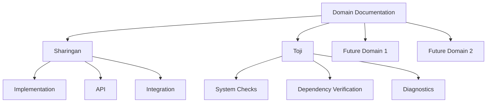

# iHoje Domain Documentation

This directory contains technical documentation for the core domains in the iHoje codebase.

## Available Documentation

### Sharingan - Pattern Recognition System

[Sharingan Implementation Guide](sharingan_implementation.md) - Documentation for the event pattern recognition system that powers the scraping functionality.

The Sharingan module is responsible for:
- Extracting structured data from HTML content
- Identifying patterns across different event pages
- Providing multiple levels of data extraction strategies
- Rate-limited and respectful web scraping

### Toji - System Doctor

[Toji Implementation Guide](toji_implementation.md) - Documentation for the system doctor and dependency checker.

The Toji module is responsible for:
- Checking required binary installations (Docker, curl, etc.)
- Verifying environment configurations (API keys, etc.)
- Ensuring required services are running (PostgreSQL, etc.)
- Providing diagnostic information for missing dependencies

## Diagram Standard

All domain documentation uses Mermaid diagrams for visualization:

## Adding New Domain Documentation

When adding documentation for a new domain:

1. Create a new markdown file in this directory
2. Add a link to it in this README.md
3. Follow the established format and style
4. Use mermaid for diagrams
5. Include code examples where appropriate

## Cross-Domain Integration

For documentation that spans multiple domains, refer to the [Fullstack Development Guide](/docs/project/fullstack.md), which describes how domains interact in the complete system.