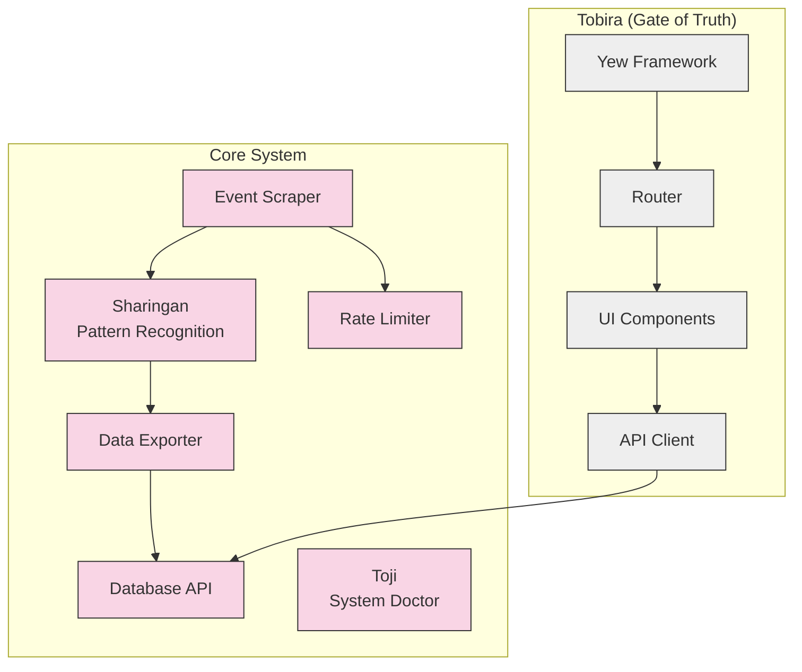

# iHoje Project Documentation

This directory contains general project documentation for iHoje, covering development processes, contribution guidelines, and general information.

## Available Documentation

| Document | Description |
|----------|-------------|
| [Contributing Guide](contributing.md) | How to contribute to the project |
| [Testing Guide](testing.md) | Testing approach and best practices |
| [Fullstack Development](fullstack.md) | Frontend and backend architecture |
| [Dependency Updates](dependency_updates.md) | Managing and updating dependencies |

## Project Overview

iHoje is a Rust-based event data collection system with anime-inspired module naming. It consists of:

- A backend scraper for collecting event data
- A pattern recognition system (Sharingan)
- A WebAssembly frontend (Tobira)
- Implementation planning tools (Mangekyou)
- System doctor for dependency checks (Toji)

## Architecture Diagram



## Key Development Commands

| Command | Description |
|---------|-------------|
| `just build` | Build the application |
| `just test` | Run all tests |
| `just run` | Run the application |
| `just run-frontend` | Run the frontend |
| `just run-toji-check` | Run system dependency check |
| `just add-task` | Create a new development task |
| `just claude` | Interact with Claude Code |

## Getting Started

For new developers, we recommend:

1. Start with the [Contributing Guide](contributing.md), which covers the setup process and development workflow
2. Run the Toji system doctor to verify your environment is properly configured:
   ```bash
   # Install Gleam if needed
   just toji-install-gleam
   
   # Run the system checker
   just run-toji-check
   ```
3. Follow the setup instructions for any missing dependencies

### System Requirements

The Toji system doctor checks for these required components:
- Docker: For containerized services
- curl: For API testing and downloads
- Google Cloud CLI: For GCP deployments
- PostgreSQL client: For database operations
- Brave Search API key: For search functionality