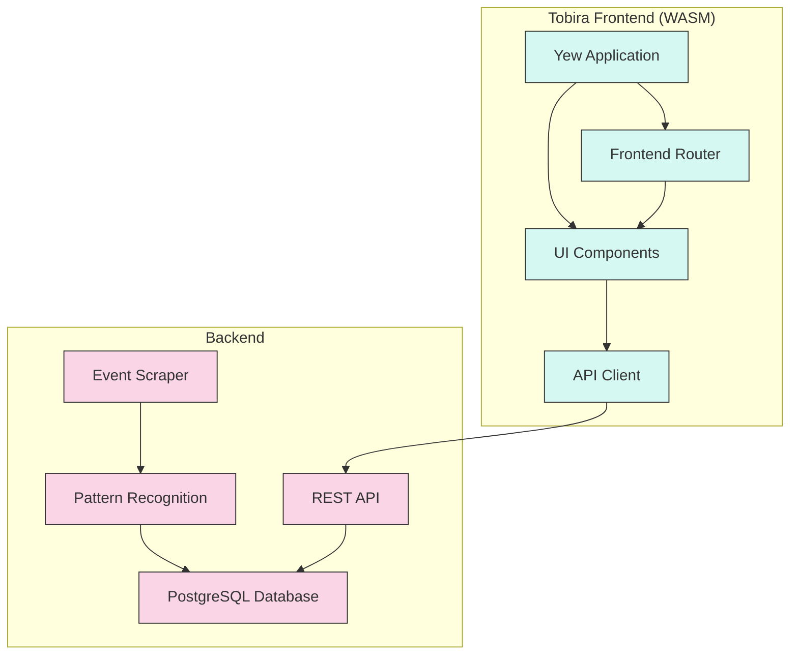

# Fullstack Development with iHoje

## Overview

This guide explains the fullstack architecture of iHoje, which uses a Rust backend and a Rust/WebAssembly frontend architecture.

## Architecture



## Backend Components

### Event Scraper

The backend scraper is responsible for collecting event data from various providers:

- **Providers**: Modular system for different event sources
- **Rate Limiting**: Smart request throttling to respect provider limits
- **Pattern Recognition**: Using the Sharingan module to identify event patterns

### REST API

The HTTP API serves event data to clients:

- **Routes**: RESTful endpoints for querying events
- **Filters**: Query parameters for filtering events
- **Caching**: Response caching for improved performance

### Database

PostgreSQL database stores all scraped event data:

- **Events**: Main event data
- **Venues**: Information about event locations
- **Prices**: Pricing information

## Frontend Components

### Yew Application

The frontend is built with Yew, a Rust framework for creating web applications:

- **WebAssembly**: Compiled to WASM for browser execution
- **Component-Based**: Modular component architecture
- **Hooks**: State management using Yew hooks

### UI Components

Reusable UI components:

- **EventCard**: Displays individual events
- **EventList**: Grid display of events
- **FilterBar**: UI for filtering events
- **DatePicker**: For date-based filtering

### Router

Handles frontend navigation:

- **Routes**: Path-based routing for different views
- **Parameters**: Route parameters for specific events
- **Guards**: Authentication guards for protected routes

### API Client

Communicates with the backend API:

- **HTTP Client**: Handles API requests
- **Serialization**: Converts between Rust types and JSON
- **Error Handling**: Graceful error handling and retries

## Development Workflow

### Running the Stack

Start both backend and frontend for development:

```bash
# Start the backend API server
just run

# In another terminal, start the frontend
just run-frontend
```

### Separate Development

For frontend-only development:

```bash
# Start the frontend with mock data
just run-frontend-mock
```

For backend-only development:

```bash
# Run the backend with API docs
just run-with-docs
```

## Data Flow

1. **Backend**: Scrapes events from providers
2. **Backend**: Processes and stores events in database
3. **API**: Serves events through REST endpoints
4. **Frontend Client**: Fetches events from API
5. **Frontend Components**: Render events with filtering

## Shared Models

The `ihoje_models` crate provides shared data structures used by both frontend and backend:

- **Event**: Core event data structure
- **Venue**: Venue information
- **Price**: Pricing information
- **Query**: Query parameters for filtering

## Deployment

### Docker Containers

The application can be deployed using Docker:

```bash
# Build both containers
just build-containers

# Deploy with Docker Compose
just deploy
```

### Configuration

Configuration is managed through environment variables specified in `.env` files:

- **Backend**: Database connection, provider settings
- **Frontend**: API URL, feature flags

## Development Tips

### Hot Reloading

- Frontend uses Trunk for hot reloading
- Backend uses cargo-watch for auto-restarting

### Debugging

- Frontend: Use browser developer tools for WASM debugging
- Backend: Use logging with different verbosity levels

### Testing

- Frontend: Component tests with Yew test utilities
- Backend: Integration tests for API endpoints
- E2E: Workflow tests for complete user journeys