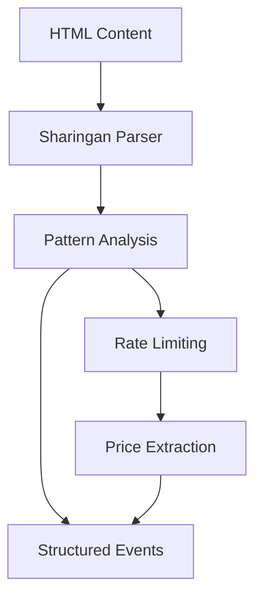

# DEPRECATED - Moved to docs/domain/sharingan_implementation.md

> **Note**: This file has been relocated to the new documentation structure at [/docs/domain/sharingan_implementation.md](/docs/domain/sharingan_implementation.md). Please use the new location for the most up-to-date version.

# Sharingan - Visual Pattern Recognition System


## Overview

The Sharingan module is the core visual pattern recognition engine of the iHoje application. Named after the powerful ocular ability from the Naruto universe, it provides advanced DOM traversal and HTML analysis capabilities for extracting structured event data from web pages.

Just as the Sharingan eye can perceive and copy movements with exceptional clarity, our Sharingan module can recognize patterns in HTML and extract meaningful data with impressive accuracy.

## Core Capabilities

### Pattern Recognition
The Sharingan can identify complex patterns within HTML DOM structures, allowing it to extract event information even when the structure changes slightly between pages.

### Multi-Level Perception
Like its namesake, the Sharingan has multiple levels of perception:
- **Basic Recognition**: Simple element selection and text extraction
- **Pattern Matching**: Identifying repeated structures such as event listings
- **Adaptive Learning**: Automatically adjusting to minor changes in page structure

### Data Extraction
The Sharingan can extract various types of event data:
- Event titles and descriptions
- Dates and times
- Venue information
- Price data (with multiple fallback strategies)
- Images and promotional content

## How It Works



The module employs multiple techniques for extracting data:
1. **DOM Selection**: Using CSS selectors to target specific elements
2. **Fallback Chains**: Multiple strategies with graceful degradation
3. **Regex Pattern Matching**: For complex or irregular data
4. **Rate-Limited Scraping**: Respectful access to source websites

## Key Functions

- `scrape_events_page`: Extract HTML from event pages
- `fetch_event_prices`: Get detailed price information for events
- `extract_events`: Transform raw HTML into structured event objects

## Integration with Tobira

The Sharingan module provides the "vision" that powers the Tobira (Gate of Truth) frontend. While Sharingan perceives and extracts the raw knowledge, Tobira serves as the gateway that presents this knowledge to users in a structured, accessible form.

## Development

When extending the Sharingan module:

1. Always respect robots.txt and site terms of service
2. Add comprehensive selectors with multiple fallbacks
3. Implement backoff strategies for failed requests
4. Use the test fixtures to validate your changes
5. Add proper logging for troubleshooting

## Examples

### Basic Scraping

```rust
// Initialize the client
let client = init_client(api_key)?;

// Configure scraping options
let options = ScrapeOptions {
    formats: Some(vec![ScrapeFormats::HTML]),
    ..Default::default()
};

// Scrape the page with rate limiting
rate_limiter.wait().await;
let result = client.scrape_url(&target_url, options).await?;
```

### Price Extraction

```rust
// Try multiple price extraction strategies
let price = find_price(&document)
    .or_else(|| find_price_in_text(&document))
    .or_else(|| find_price_with_regex(&html_content))
    .unwrap_or_else(|| "Price not available".to_string());
```