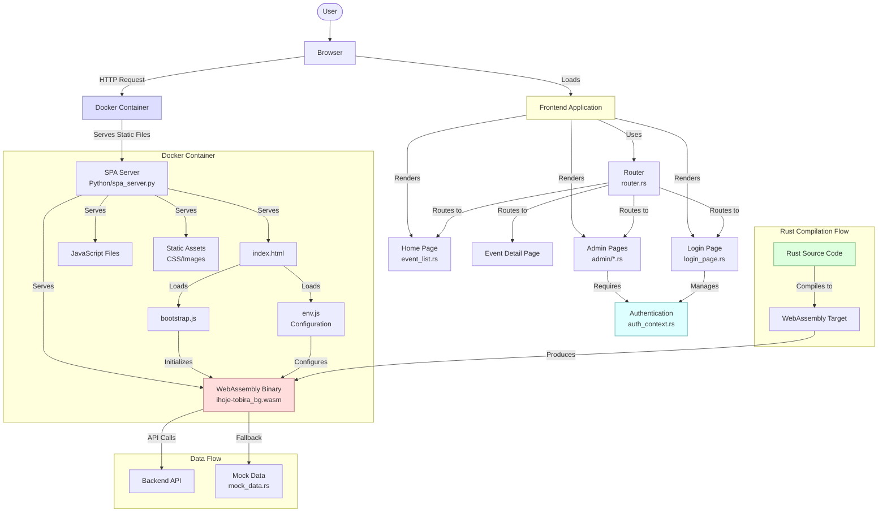

# Shinri no Tobira (Gate of Truth)

WebAssembly frontend for the iHoje event system.

## Overview

Shinri no Tobira (Gate of Truth) is the WebAssembly frontend for the iHoje event system, named after the gate from Fullmetal Alchemist. It's built with Rust and the Yew framework, compiled to WebAssembly for client-side rendering.

## Quick Start

To get started with the frontend:

```bash
# Build and run the frontend with WebAssembly support
cd fix-scripts
./launch-tobira.sh

# OR for just building without running the server
./build-frontend.sh
```

## Troubleshooting WebAssembly Issues

We've created automated scripts to simplify WebAssembly debugging:

1. **Fix all WebAssembly issues at once**:
   ```bash
   # Apply all fixes and create backups
   ./fix-wasm-frontend.sh
   
   # Restart only the WebAssembly container
   ./restart-wasm-tobira.sh
   ```

2. **Check what's wrong with WebAssembly loading**:
   ```bash
   # Run automated diagnostics
   ./debug-wasm.sh
   ```

3. **Common issues automatically fixed**:
   - MIME type problems - files are now served with `application/wasm`
   - File name mismatches - code maps between filenames automatically
   - Supabase SRI integrity failures - removed integrity check
   - WebAssembly initialization errors - enhanced error handling
   
For more detailed debugging information, see [DEBUG.md](DEBUG.md)

## Running with Docker

We've created improved scripts for Docker deployment:

```bash
# Run both containers (Mock on 8080, WebAssembly on 8081)
./run-both-tobiras.sh

# Run only the WebAssembly version with all fixes
./fix-wasm-frontend.sh && ./restart-wasm-tobira.sh

# Check container status and diagnose issues
./check-tobiras.sh
./debug-wasm.sh

# Docker Compose alternative (more configurable)
./run-tobiras-docker-compose.sh
```

The WebAssembly version runs on port 8081: http://localhost:8081

## Development

When developing the frontend:

1. Make changes to the Rust code in the `src/` directory
2. Run `./fix-scripts/build-frontend.sh` to rebuild
3. Start the server with `python3 fixed_server.py 8081 dist`

## Mock Data Mode

For development without a backend, use mock data mode:

1. The mock data is enabled by default in the env.js configuration
2. The WebAssembly initialization code calls `wasm.enable_mock_data()`
3. Sample events are defined in `src/utils/mock_data.rs`

## Technical Architecture

The frontend is built with:

- **Rust + Yew**: For component-based UI development
- **wasm-bindgen**: For WebAssembly/JavaScript interoperability
- **WebAssembly**: For running Rust code in the browser
- **SPA Architecture**: Single Page Application with client-side routing

### Technology Stack Relationship



### Critical Components

1. **Docker Container**: Isolates and packages the application for consistent deployment
2. **Python SPA Server**: Handles HTTP requests and serves static files with correct MIME types
3. **WebAssembly Binary**: Compiled Rust code that runs in the browser
4. **Rust Frontend Code**: Component-based UI built with the Yew framework
5. **Authentication Flow**: Manages user sessions and admin access
6. **Router**: Handles client-side navigation between pages

## Deployment

### Local Deployment

For local production deployment:

1. Set `IHOJE_ENVIRONMENT=production` for stricter CSP headers
2. Build with `wasm-pack build --target web --release`
3. Use the Docker container for consistent deployment

### GCP Deployment

For deploying to Google Cloud Platform:

1. Set up required GCP resources:
   ```bash
   # Run the setup script to create necessary GCP resources
   ../scripts/setup-gcp-tobira.sh
   ```

2. Configure GitHub secrets for CI/CD:
   - Add `GCP_PROJECT_ID` and `GCP_SA_KEY` to your repository secrets
   - See [GCP Deployment Guide](/docs/project/gcp_deployment.md) for details

3. Deploy via CI/CD:
   - Push changes to the main branch to trigger automatic deployment
   - Two Cloud Run services will be created:
     - **Mock Tobira**: Simple version without WebAssembly
     - **Shinri-no-Tobira**: Full WebAssembly version

For complete GCP deployment instructions, see the [GCP Deployment Guide](/docs/project/gcp_deployment.md).

## Known Issues and Solutions

### Localhost:8081 Infinite Loading Issue

**Problem**: When accessing http://localhost:8081/, the page shows "Loading..." indefinitely and doesn't render the application.

**Root Causes**:

1. **MIME Type Mismatch**: The WebAssembly binary isn't served with the correct `application/wasm` MIME type
2. **Path Resolution**: The browser can't find the WebAssembly file at the expected location
3. **Bootstrap Error Handling**: Errors during WebAssembly initialization aren't properly reported
4. **Container Port Mapping**: Container internal port doesn't match the exposed port
5. **SRI Integrity Checks**: The Supabase library has strict SRI integrity checks that fail

**Solution Steps**:

1. Run the automated fix script that addresses all issues:
   ```bash
   # Apply all fixes and create backups
   ./fix-wasm-frontend.sh
   
   # Restart the WebAssembly container
   ./restart-wasm-tobira.sh
   ```

2. Verify the fix worked by:
   - Checking browser console for any remaining errors
   - Verifying the HTTP response headers include `Content-Type: application/wasm` for .wasm files
   - Confirming the WebAssembly binary is loading successfully
   - Checking that the container maps port 8081 on host to port 8080 internally

3. If issues persist, run the diagnostic script:
   ```bash
   ./debug-wasm.sh
   ```

4. Browser Console Debugging:
   ```javascript
   // Check if WebAssembly binary loaded correctly
   console.log('wasm module status:', window.__wasm_module_status);
   
   // Check if env.js loaded correctly
   console.log('env config:', window.ihoje_env);
   
   // Force mock data mode as a temporary fix
   if (window.wasm) {
     window.wasm.enable_mock_data();
     window.wasm.render();
   }
   ```

For a comprehensive breakdown of all WebAssembly issues and their solutions, see [DEBUG.md](DEBUG.md).